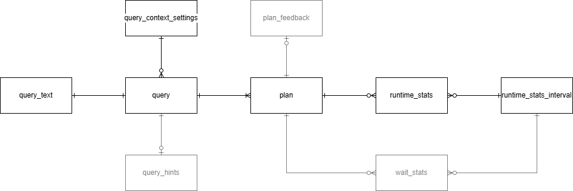

# Query Store DMVs & Their Relations

[Query Store catalog views](https://learn.microsoft.com/en-us/sql/relational-databases/system-catalog-views/sys-query-context-settings-transact-sql)

[draw.io file](./dmv-erd.drawio) maps the following relations:

* [query_text][query_text] `+--+` query
  * every query has a single query text & vice versa
  * cross-reference so query_text keeps the blob data off of
* [query][query] `+-|<` [plan][plan]
  * a query must have a plan, but may have many
* [plan][plan] `+-o<` runtime_stats
  * runtime_stats must belong to a plan
  * however, a plan may persist after runtime_stats have aged out
* [runtime_stats][runtime_stats] `>o-+` [runtime_stats_interval][runtime_stats_interval]
  * `rsi` is a timespan/clock table. many stats may use the same bucket as defined in `rsi`
* [query][query] `>o-+` [query_context_settings][query_context_settings]
  * every query must have a context 
  * most queries will share the same context
  * `qcs` comes from the connection context & `set` commands executed prior to the query

The `sys.query_store_*` prefix has been truncated for readability.

The following relations are "mapped" tentatively. They are left at 50% opacity to indicate partial familiarity by the author. The crows-foot indicators may be inaccurate

* [plan_feedback][plan_feedback]
* [query_hints][query_hints]
* [wait_stats][wait_stats]

The following relations are excluded.

* [options][options]
  * config table for QS instance/ does not relate to query data
* [internal_state][internal_state]
  * internal QS config table
* [query_variant][query_variant]
  * standalone table? author is unfamiliar
* [plan_forcing_locations][plan_forcing_locations]
  * 2022 only
* [replicas][replicas]
  * 2022 only

[query_text]: https://learn.microsoft.com/en-us/sql/relational-databases/system-catalog-views/sys-query-store-query-text-transact-sql
[query]: https://learn.microsoft.com/en-us/sql/relational-databases/system-catalog-views/sys-query-store-query-transact-sql
[plan]: https://learn.microsoft.com/en-us/sql/relational-databases/system-catalog-views/sys-query-store-plan-transact-sql
[runtime_stats]: https://learn.microsoft.com/en-us/sql/relational-databases/system-catalog-views/sys-query-store-runtime-stats-transact-sql
[plan_feedback]: https://learn.microsoft.com/en-us/sql/relational-databases/system-catalog-views/sys-query-store-plan-feedback
[query_hints]: https://learn.microsoft.com/en-us/sql/relational-databases/system-catalog-views/sys-query-store-query-hints-transact-sql
[wait_stats]: https://learn.microsoft.com/en-us/sql/relational-databases/system-catalog-views/sys-query-store-wait-stats-transact-sql
[runtime_stats_interval]: https://learn.microsoft.com/en-us/sql/relational-databases/system-catalog-views/sys-query-store-runtime-stats-interval-transact-sql
[query_context_settings]: https://learn.microsoft.com/en-us/sql/relational-databases/system-catalog-views/sys-query-context-settings-transact-sql
[options]: https://learn.microsoft.com/en-us/sql/relational-databases/system-catalog-views/sys-database-query-store-options-transact-sql
[plan_forcing_locations]: https://learn.microsoft.com/en-us/sql/relational-databases/system-catalog-views/sys-query-store-plan-forcing-locations-transact-sql
[replicas]: https://learn.microsoft.com/en-us/sql/relational-databases/system-catalog-views/sys-query-store-replicas
[internal_state]: https://learn.microsoft.com/en-us/sql/relational-databases/system-catalog-views/sys-database-query-store-internal-state-transact-sql
[query_variant]: https://learn.microsoft.com/en-us/sql/relational-databases/system-catalog-views/sys-query-store-query-variant
