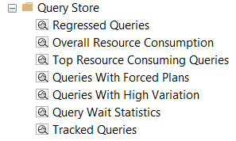

# Raw Profiler Trace Queries

Query Store has a Pretty Good™️ native GUI. `*.sql` files in this directory are the queries SMO passes to the connected database when launching the default tabs.

The files are formatted in the sibling directory [Formatted](../Formatted) but the raw SMO queries are preserved here for reference.

* [Regressed Queries](./RegressedQueries.sql)
* [Overall Resourse Consumption](./OverallResourseConsumption.sql)
* [Top Resource Consuming Queries](./TopResourceConsumers.sql)
* [Queries With Forced Plans](./QueriesWithForcedPlans.sql)
* [Queries With High Variation](./QueriesWithHighVariation.sql)
* [Query Wait Statistics](./QueryWaitStatistics.sql)
* [Tracked Queries](./TrackedQueries.sql)
